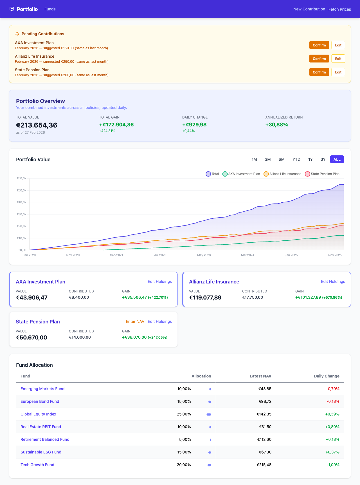

# Investments Portfolio

A personal, local Rails dashboard to track mutual funds across insurance policies and pension plans. Imports historical monthly data from CSV, fetches daily NAV prices from Yahoo Finance, and displays portfolio value, gains, and line charts broken down by policy.



## Features

- **Multi-policy tracking** — insurance policies and pension plans, each with their own fund holdings
- **Historical snapshots** — import monthly portfolio values from a CSV export
- **Live NAV prices** — auto-fetched daily from Yahoo Finance via Solid Queue; manual entry for funds not listed on Yahoo Finance
- **Dashboard** — total value, total gain, daily change, annualized return, and a multi-line chart (Total + per-policy) with period selectors (1M, 3M, 6M, YTD, 1Y, 3Y, ALL)
- **Pending contributions** — prompts you when a recurring monthly contribution is due

## Requirements

- Ruby 4.0.1 (via asdf — see `.tool-versions`)
- SQLite

## Setup

```bash
bin/setup          # Install gems, create and migrate DB
bin/rails db:seed  # Seed example funds and policies
bin/dev            # Start the development server
```

Open http://localhost:3000 in your browser.

## Customising for your own funds

Edit `db/seeds.rb` to replace the example funds and policies with your own:

- **Insurance funds** — add a row per fund with its ISIN and Yahoo Finance ticker
- **Pension fund** — set `yahoo_ticker: nil`; NAV is entered manually via `/admin/nav_entries/new`
- **Policies** — one row per policy (insurance or pension), with a unique `slug`

After editing seeds, run `bin/rails db:seed` to populate.

## Usage

### 1. Import historical CSV data

Place your `portfolio.csv` in `tmp/imports/` and click "Import CSV" on the dashboard. The CSV should be semicolon-delimited with columns: `Policy;Date;Total Value;Total Contributed;Total Delta;Monthly Change;Contribution`.

### 2. Enter current holdings

Click "Edit Holdings" on any policy card to enter the number of units you hold per fund.

### 3. Fetch daily prices

Click "Fetch Prices" in the nav bar, or wait for the daily Solid Queue job (runs at 6 pm UTC on weekdays).

### 4. Enter NAV manually (pension plans)

For funds not on Yahoo Finance, use `/admin/nav_entries/new` to enter the NAV for a given date.

## Testing

```bash
bundle exec rspec    # Run the full test suite
bundle exec rubocop  # 0 offenses
```

## Tech Stack

- Ruby on Rails 8.1, Ruby 4.0.1, SQLite
- Tailwind CSS, Chartkick + Chart.js
- RSpec, FactoryBot, WebMock
- Faraday (Yahoo Finance), Solid Queue (background jobs)
